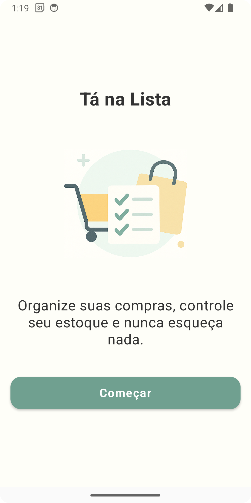
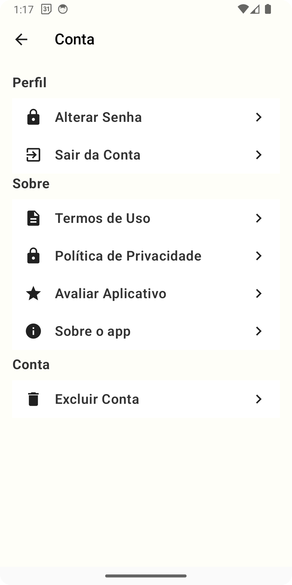
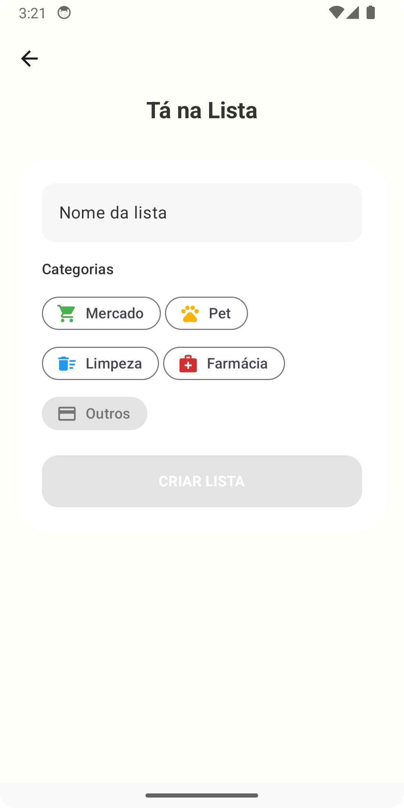
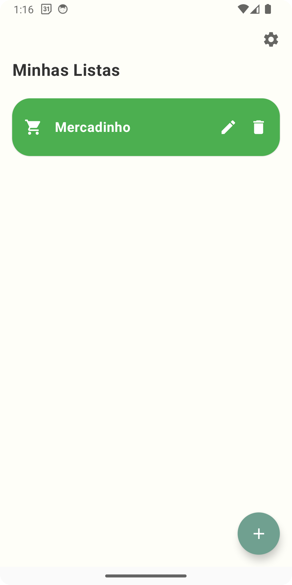
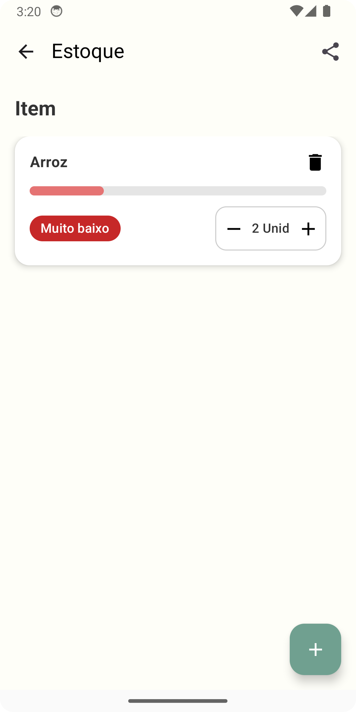
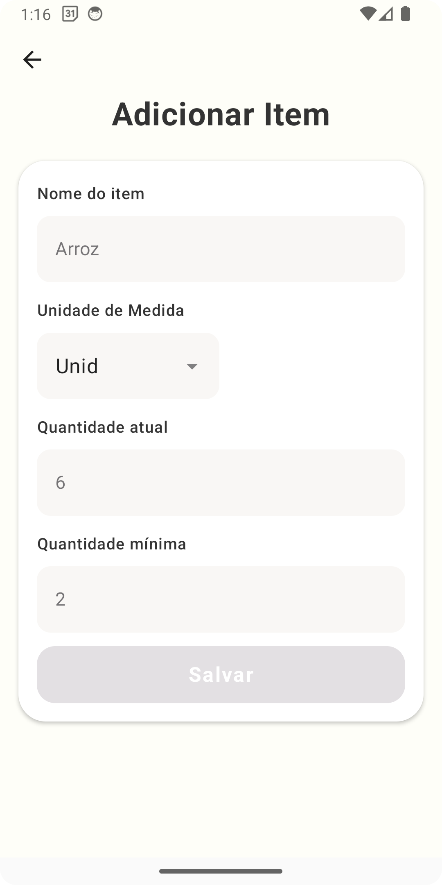

# 🛒 Tá na Lista

Aplicativo de lista de compras feito em Kotlin com Jetpack Compose. Gerencie seus itens, quantidades mínimas e sincronização com o Firebase de forma prática e moderna.

> ⚠️ Este app ainda **não está publicado na Play Store**. Você pode rodá-lo localmente pelo Android Studio.

---

## 🖼️ Galeria de Telas

| Tela de Boas-vindas | Tela de Login | Tela de Menu |
|---------------------|---------------|---------------|
|  |  |  |

| Tela de Criar Lista | Tela de Listas | Tela de Compartilhamento |
|---------------------|----------------|----------------------------|
|  |  |  |

| Tela de Estoque | Tela de Adicionar Item |
|-----------------|------------------------|
|  |  |


## ✅ Funcionalidades

- [x] - Criação de usuário
- [x] - Criação e edição de listas de compras
- [x] - Cadastro de itens com quantidade mínima e atual
- [x] - Compartilha sua lista de compras
- [x] - Sincronização com Firebase Firestore
- [x] - Alterar senha
- [x] - Apagar conta
- [x] - Política de Privacidade
- [x] - Termos de Uso
- [x] - Sobre o app

---

## Próximos passos

- [ ] - Teste unitários e instrumentados
- [ ] - Criação do repository

---

## 🚀 Como rodar o projeto

1. Clone o repositório:
   ```bash
   git clone https://github.com/silva021/Ta_na_lista.git
   ```

2. Abra o projeto no Android Studio

3. Configure um dispositivo/emululador Android

4. Rode o projeto

> ⚠️ Você pode precisar configurar o `google-services.json` com seu próprio Firebase

---

## 🧪 Tecnologias utilizadas

- Kotlin
- Jetpack Compose
- Firebase Authentication
- Firebase Firestore
- MVVM
- Koin
- DataStore

---

## 🔗 Links úteis

- 📄 [Política de Privacidade](https://silva021.github.io/Ta_na_lista/politica-de-privacidade.html)
- 📜 [Termos de Uso](https://silva021.github.io/Ta_na_lista/termos-de-uso.html)
- 🔗 [Meu linkedin](https://www.linkedin.com/in/devandroidlucas/)

---

## 👤 Desenvolvedor

Lucas Silva Sousa  
📧 lucasssilva021@gmail.com  
🌐 Desenvolvedor Android | Kotlin | Compose
